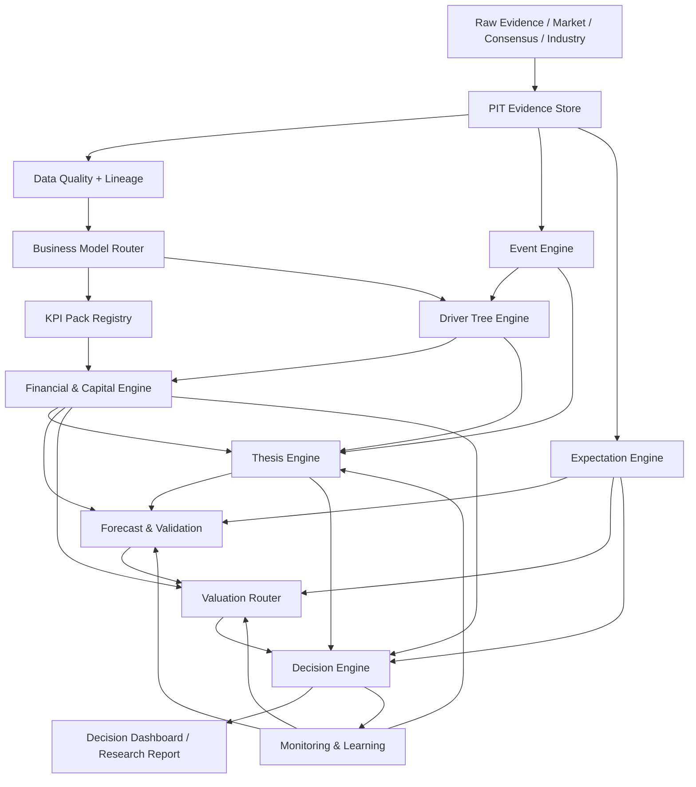
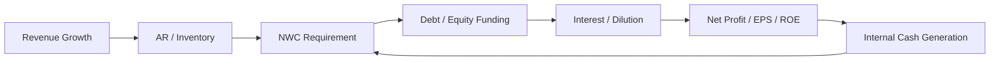
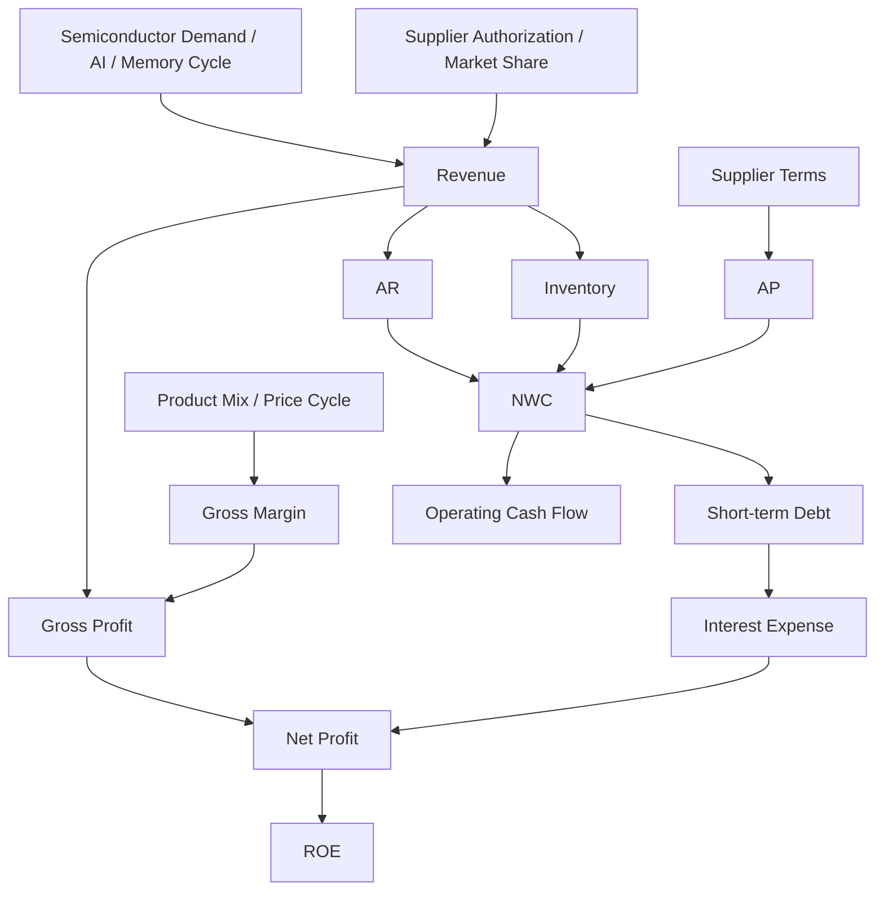
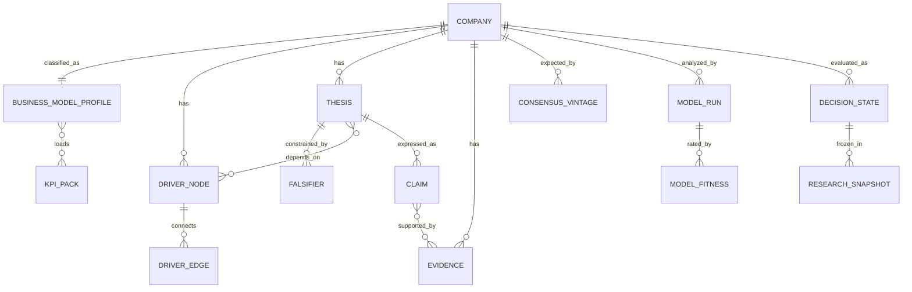

# Research OS v1.1 完整规范
## 从“专业财务研究自动化系统”升级为“可持续迭代的投资决策操作系统”

**版本：** v1.1.0  
**状态：** Baseline / Design Specification  
**上游版本：** Research OS v1.0（《面向钢研高纳研究工作流的专业级自动化财务分析平台设计报告》）  
**设计目标：** 在不破坏 v1.0 Point-in-Time、财务计算、统计检验、估值、来源追溯和可复现性底座的前提下，引入商业模式路由、Driver Tree、Thesis/Anti-Thesis、预期差、资本循环、模型适用性、Evidence Ledger、决策状态与持续学习，使系统能够跨行业复用并持续升级。

---

# 0. 版本定义

Research OS v1.1 不是 v1.0 的推倒重来，而是一次**研究语义层与决策层升级**。

v1.0 解决的核心问题是：

> 如何把“找公告—抄数据—算财务指标—跑统计模型—估值—写报告”工程化、可复现化、Point-in-Time 化。

v1.1 进一步解决：

> 面对不同商业模式的公司，系统应该先研究什么？  
> 哪些变量是真正决定企业价值的核心变量？  
> 当前投资逻辑是在加强还是被证伪？  
> 实际经营结果相对市场预期是好还是坏？  
> 哪一种估值方法在当前阶段最可信？  
> 新信息出现后，过去观点应该如何自动更新？

因此 v1.1 的核心产品不再只是“自动化研究报告”，而是：

> **Evidence → Business Model → Drivers → Financial Quality → Thesis → Expectations → Forecast → Valuation → Decision State → Monitoring/Learning**

---

# 1. v1.1 设计原则

## 1.1 六条不可破坏的系统不变量

### I. No Time Travel
任何历史回测、预测、信号和研究快照只能使用当时已经公开的信息。

必须同时保存：

- `period_end`
- `publish_ts`
- `ingested_at`

回测信息集必须满足：

```text
source_publish_ts <= decision_ts
```

### II. No Fabricated Data
缺失就是缺失。

季度附注、产品细分、库存结构等未披露字段不得为了“模型完整”而插值制造。

### III. Facts ≠ Calculations ≠ Statistics ≠ Assumptions
任何结论必须明确属于：

- A：原始披露直接事实
- B：确定公式计算
- C：有统计支持
- D：样本不足的方向性证据
- E：专家假设/情景

### IV. Everything Has Lineage
任何指标、图表、预测、估值和研究结论都必须可以追溯到：

```text
Claim
→ Formula / Model
→ Input Facts
→ Source document
→ Page / table / field
→ dataset_version
→ formula_version
→ model_version
→ report_version
```

### V. Models Must Beat Simple Benchmarks
复杂模型必须在 Rolling / Expanding OOS 中优于合理简单基准，否则不得升级成正式有效模型。

### VI. Research Signal ≠ Automatic Trading
Research OS 输出研究状态和风险预算信息，不执行机械买卖动作。

---

# 2. v1.1 顶层架构



v1.1 分成十个逻辑层：

1. Evidence Layer
2. Business Model Router
3. KPI Pack Registry
4. Driver Tree Engine
5. Financial & Capital Engine
6. Thesis / Anti-Thesis Engine
7. Expectation Engine
8. Forecast & Valuation Router
9. Decision Engine
10. Monitoring & Learning Layer

---

# 3. Evidence Layer：继承并强化 v1.0

## 3.1 原始数据仍是第一事实源

优先级：

```text
公司/监管正式披露
>
交易所/官方数据
>
商业数据库结构化字段
>
原始卖方研报
>
可信二手来源
>
未经核验二手转述
```

商业数据库是加速层和交叉验证层，不是唯一真相源。

## 3.2 Evidence Object

v1.1 新增统一证据对象：

```yaml
evidence_id:
company_id:
evidence_type:
  - filing_fact
  - market_data
  - consensus
  - management_statement
  - industry_data
  - calculated_metric
  - statistical_result
  - analyst_assumption

period_end:
publish_ts:
ingested_at:

value:
unit:
scope:

source_document_id:
source_page:
source_table:
source_url:

confidence_grade: A|B|C|D|E
verification_status:
  - PRIMARY_VERIFIED
  - SECONDARY_VERIFIED
  - SECONDARY_UNVERIFIED
  - ESTIMATED
  - ASSUMPTION

dataset_version:
parser_version:
formula_version:
model_version:
```

---

# 4. Business Model Router：v1.1 P0 新模块

## 4.1 为什么需要 Router

同一个财务指标在不同商业模式中的解释完全不同。

例如：

- 制造企业：Capex、CIP、PPE、利用率、折旧非常关键。
- 分销企业：DSO、库存周转、短期融资、利息成本更关键。
- 软件企业：递延收入、续费率、ARR、S&M 效率更关键。
- 资源企业：产量、售价、现金成本、储量、资本开支更关键。

因此系统不得再默认：

```text
Company → Manufacturing Template
```

而必须：

```text
Company
→ Business Model Classification
→ KPI Pack(s)
→ Driver Tree
→ Analysis
```

## 4.2 Router 输出

```yaml
business_model_profile:
  primary_model: distributor
  secondary_models:
    - platform
  confidence: 0.91
  manual_override: false

  evidence:
    - revenue composition
    - inventory/revenue
    - supplier relationships
    - fixed asset intensity
    - gross margin structure
```

## 4.3 首批标准商业模式

### A. Manufacturing
适用于：
- 高端制造
- 军工材料
- 半导体制造
- 设备制造
- 汽车零部件

### B. Distributor
适用于：
- 半导体分销
- 医药流通
- IT 分销
- 大宗贸易型渠道

### C. Software / Subscription
适用于：
- SaaS
- 企业软件
- 云服务

### D. Consumer / Brand
适用于：
- 食品饮料
- 家电
- 服装
- 美妆
- 品牌消费

### E. Resource / Commodity
适用于：
- 有色
- 煤炭
- 油气
- 化工资源品

### F. Project / EPC
适用于：
- 工程
- 系统集成
- 长周期项目制企业

### G. Financial / Special
银行、券商、保险等进入独立体系，不直接复用普通工业企业资产负债逻辑。

## 4.4 多商业模式公司

允许：

```text
primary_model + secondary_model + segment-specific model
```

禁止为了唯一分类强行丢失重要业务结构。

---

# 5. KPI Pack Registry：从固定模板改成插件体系

每个 KPI Pack 必须声明：

```yaml
pack_id:
pack_version:
eligible_business_models:
required_facts:
optional_facts:
metrics:
red_flags:
benchmark_groups:
valuation_preferences:
missing_policy:
```

## 5.1 Manufacturing Pack

继承 v1.0 钢研高纳能力：

- DuPont / Shapley
- Gross Margin
- OCF / NP
- AR Days
- Inventory Days
- Contract Liabilities
- FCF
- Capex Intensity
- CIP
- PPE
- Fixed Asset Turnover
- Depreciation Pressure
- Capacity Utilization
- Product Mix
- Raw Material Sensitivity

## 5.2 Distributor Pack

v1.1 新增：

### 核心周转
\[
DSO=\frac{AverageAR}{Revenue}\times365
\]

\[
DIO=\frac{AverageInventory}{COGS}\times365
\]

\[
DPO=\frac{AverageAP}{COGS}\times365
\]

\[
CCC=DSO+DIO-DPO
\]

### 营运资本强度
\[
NWCIntensity=\frac{AR+Inventory-AP}{Revenue}
\]

### 增量资金需求
\[
IncrementalNWCIntensity=
\frac{\Delta NWC}{\Delta Revenue}
\]

### 融资压力
- Short Debt / Inventory
- Short Debt / Equity
- Net Debt / Equity
- Interest Expense / Gross Profit
- Interest Coverage
- CFO / NP
- CFO / EBITDA
- Debt-funded Growth Score

### 库存风险
- Inventory Growth vs Revenue Growth
- Inventory Write-down / Inventory
- Inventory Days trend
- Inventory price exposure
- product-cycle exposure

### 供应链
- Supplier concentration
- Original-vendor authorization
- Customer concentration
- Credit terms
- Supplier financing
- Customer financing

### 盈利结构
- Gross margin
- Gross profit / working capital
- ROIC
- ROA
- Asset turnover

## 5.3 Software Pack

预留：

- ARR / MRR
- Net Revenue Retention
- Gross Retention
- Deferred Revenue
- Remaining Performance Obligations
- CAC Payback
- LTV/CAC
- Rule of 40
- S&M efficiency
- Stock-based compensation
- FCF margin

## 5.4 Consumer Pack

预留：

- Same-store / volume / ASP
- Channel inventory
- Distributor receivables
- Gross margin
- Advertising intensity
- Inventory turns
- ROIC
- Working capital
- Brand reinvestment

## 5.5 Resource Pack

预留：

- Production volume
- Realized price
- Cash cost
- AISC / unit economics
- Reserve life
- Capex
- Commodity sensitivity
- Net debt
- Dividend capacity

---

# 6. Driver Tree Engine：v1.1 P0 核心模块

## 6.1 目标

研究公司时不再从“有哪些指标”出发，而是从：

> **什么变量真正驱动 Revenue、Margin、Cash Flow、ROIC 和 Equity Value？**

出发。

## 6.2 Driver Node

```yaml
driver_id:
company_id:
driver_name:
driver_type:
  - demand
  - price
  - volume
  - mix
  - cost
  - working_capital
  - capex
  - financing
  - regulation
  - competition
  - valuation

observable_metric:
direction:
lag:
confidence_grade:
source:
```

## 6.3 Driver Edge

```yaml
from_driver:
to_driver:
relation:
  - positive
  - negative
  - nonlinear
  - conditional

lag_quarters:
evidence_strength:
statistical_support:
mechanism_description:
```

## 6.4 标准 Driver Tree

```text
Demand / Volume / Price / Mix
        ↓
      Revenue
        ↓
Gross Margin / Gross Profit
        ↓
Operating Profit
        ↓
   Net Profit
        ↓
Operating Cash Flow
        ↓
    Free Cash Flow

同时：

Revenue Growth
→ AR / Inventory / AP
→ NWC
→ External Funding
→ Interest Cost
→ Net Profit / Equity Value
```

## 6.5 Driver Ranking

每次研究输出：

```text
Top 3 current drivers
Top 3 emerging risks
Top 3 observables for next verification
```

评分建议：

\[
DriverPriority =
Materiality
\times
Uncertainty
\times
Observability
\times
DecisionRelevance
\]

---

# 7. Financial & Capital Engine v1.1

v1.0 财务引擎全部保留。

v1.1 重点新增“资本效率”和“资金循环”。

## 7.1 ROIC

\[
ROIC=
\frac{NOPAT}{AverageInvestedCapital}
\]

要求区分：

- Reported ROIC
- Normalized ROIC
- Incremental ROIC

## 7.2 Incremental ROIC

\[
IncrementalROIC=
\frac{\Delta NOPAT}{\Delta InvestedCapital}
\]

对于高速增长公司，这比静态 ROE 更能判断增长是否创造价值。

## 7.3 Incremental Working Capital Requirement

\[
IWCR=
\frac{\Delta NWC}{\Delta Revenue}
\]

解释：

- 越低：增长越“轻资金”
- 越高：增长越依赖融资
- 为负：可能具有客户预付款/供应商融资能力

## 7.4 Funding Loop Engine



输出：

```yaml
funding_state:
  type:
    - self_funded
    - mixed
    - debt_funded
    - equity_funded
    - stressed

  incremental_revenue:
  incremental_nwc:
  incremental_debt:
  incremental_interest:
  cash_conversion:
```

## 7.5 Growth Quality Score

不建议只看收入增速。

推荐：

```text
Growth
+ Margin
+ ROIC
+ Cash Conversion
+ Incremental NWC efficiency
- Leverage deterioration
- Dilution
```

---

# 8. Thesis / Anti-Thesis Engine：v1.1 P0

## 8.1 Thesis Object

```yaml
thesis_id:
company_id:
title:
status:
  - active
  - strengthening
  - weakening
  - falsified
  - expired

statement:
mechanism:
time_horizon:

supporting_drivers:
supporting_evidence:

falsifiers:
verification_metrics:
next_check_date:

confidence:
created_at:
updated_at:
```

## 8.2 每个 Thesis 必须有 Anti-Thesis

禁止只维护多头故事。

```text
Thesis:
AI demand drives distributor revenue and profitability.

Anti-Thesis:
Revenue growth is inventory/credit-funded; cash return deteriorates and financing cost absorbs gross-profit growth.
```

## 8.3 Falsifier 必须可观测

错误：

```text
“行业不及预期”
```

正确：

```text
若未来2个季度：
Revenue YoY > 30%
但
Inventory/Revenue继续上升
且
DSO继续恶化
且
CFO仍为大幅负值
→ Growth-quality thesis downgraded
```

## 8.4 Thesis State Transition

```text
NEW
→ ACTIVE
→ STRENGTHENING
→ WEAKENING
→ FALSIFIED

也允许：
ACTIVE → EXPIRED
```

状态变化才触发高优先级提醒，减少 alert fatigue。

---

# 9. Evidence Ledger：把 A-E 分级升级成“结论账本”

## 9.1 Claim Object

```yaml
claim_id:
company_id:
claim_text:
claim_type:
  - fact
  - calculation
  - statistical
  - thesis
  - valuation
  - risk

confidence_grade:
evidence_ids:
formula_or_model:
assumptions:
falsifiers:
valid_from:
valid_until:
status:
```

## 9.2 强制格式

每个重大判断在后台都应展开为：

```text
Claim
→ Evidence
→ Calculation / Model
→ Assumptions
→ Confidence
→ Falsifier
→ Last verified
```

## 9.3 结论不能无限期有效

研究结论必须有：

```text
valid_until
next_verification_event
```

例如：

```text
“现金流质量恶化”
有效至下一份季度报告或重大应收/融资公告。
```

---

# 10. Expectation Engine：v1.1 P1

## 10.1 研究的核心不是“结果好不好”

而是：

\[
Surprise = Actual - Expected
\]

系统至少维护四套预期：

1. Current sell-side consensus
2. Previous consensus vintage
3. Internal model
4. Market-implied expectations

## 10.2 Consensus 必须 Vintage 化

```yaml
consensus_snapshot:
  as_of:
  forecast_year:
  revenue:
  net_profit:
  eps:
  gross_margin:
  source_count:
  source_quality:
```

历史研究必须看到当时的预测版本，不能使用后来修订的盈利预测。

## 10.3 Earnings Surprise Decomposition

```text
Revenue Surprise
Gross Margin Surprise
Operating Expense Surprise
Financial Expense Surprise
Net Profit Surprise
CFO Surprise
Working Capital Surprise
Guidance / Narrative Surprise
```

## 10.4 “表面 Beat，质量 Miss”

系统允许：

```text
Revenue: strong beat
Net profit: beat
CFO: material miss
Inventory: negative surprise
Debt: negative surprise
```

最终输出：

> Headline beat / Quality miss

避免只凭净利润同比生成乐观结论。

---

# 11. Forecast & Validation v1.1

继承 v1.0：

- Naive
- Seasonal Naive
- ARIMA
- SARIMA
- ARIMAX
- Rolling origin
- TimeSeriesSplit
- p-value
- CI
- OOS R²
- Bootstrap
- Spearman
- Permutation
- Multiple Testing Correction

新增：

## 11.1 Hypothesis Registry

```yaml
hypothesis_id:
statement:
economic_mechanism:
features:
target:
expected_direction:
test_method:
benchmark:
registered_before_run: true
```

避免“跑完数据再找故事”。

## 11.2 Model Promotion

```text
EXPERIMENTAL
→ CANDIDATE
→ VALIDATED
→ PRODUCTION
→ DEGRADED
→ RETIRED
```

进入 PRODUCTION 至少要求：

- OOS 优于简单基准
- 无 PIT 违规
- 稳定性达到阈值
- 经济逻辑可解释
- 预测误差可监控

## 11.3 Forecast Error Attribution

每次实际结果出来后，不只算误差，还要判断：

```text
Demand error
Price error
Margin error
Working-capital error
Financing-cost error
Model structural error
Data revision error
```

---

# 12. Valuation Router：v1.1 P1

v1.0 已有：

- PE
- EV/EBITDA
- PB/ROE
- SOTP
- DCF
- Reliability Score

v1.1 将其升级成**先判断适用性，再运行/加权**。

## 12.1 Model Fitness Score

\[
Fitness =
DataQuality
\times EarningsStability
\times CashFlowVisibility
\times CapitalStructureFit
\times BusinessModelFit
\times ForecastStability
\]

## 12.2 模型状态

```text
PRIMARY
SECONDARY
SANITY_CHECK
LOW_CONFIDENCE
NOT_APPLICABLE
```

## 12.3 典型规则

### PE
适合：
- 盈利可正常化
- EPS 有经济意义

降权：
- 周期谷底/峰值
- 一次性利润
- 极端金融费用波动

### EV/EBITDA
适合：
- 重资产
- 折旧扰动明显
- 跨资本结构比较

降权：
- 营运资本决定现金流的商业模式

### PB/ROE
适合：
- 资产基础重要
- ROE 可正常化
- 金融/资本密集企业

### DCF
适合：
- FCF 可预测
- 商业模式成熟
- 长期资本回报稳定

降权：
- 极端营运资本波动
- 高周期
- 现金流长期不可见

## 12.4 输出不再机械平均

输出：

```text
Primary valuation range
Secondary cross-check range
Outer uncertainty range
Model disagreement diagnosis
```

---

# 13. Decision Engine：从“研究信号”升级成决策状态

## 13.1 输入

```text
Fundamental State
Valuation State
Expectation State
Thesis State
Evidence Confidence
Risk State
```

## 13.2 Fundamental State

```text
IMPROVING
STABLE
DETERIORATING
UNCERTAIN
```

## 13.3 Valuation State

```text
CHEAP
FAIR
EXPENSIVE
UNRELIABLE
```

## 13.4 Expectation State

```text
UNDER_EXPECTED
IN_LINE
OVER_EXPECTED
MIXED
```

## 13.5 Thesis State

```text
STRENGTHENING
ACTIVE
WEAKENING
FALSIFIED
```

## 13.6 Decision State

系统只输出研究状态：

```text
HIGH_CONVICTION_WATCH
ACCUMULATION_CANDIDATE
WAIT_FOR_CONFIRMATION
HOLD_AND_MONITOR
RISK_REVIEW
THESIS_BROKEN
INSUFFICIENT_EVIDENCE
```

不得自动转成交易指令。

---

# 14. Event Engine：新信息必须映射到 Driver / Thesis

事件类型：

```text
financial_report
guidance
major_order
capacity
pricing
raw_material
financing
share_issue
buyback
management_change
regulation
customer
supplier
industry_price
consensus_revision
```

每个事件输出：

```yaml
affected_drivers:
affected_theses:
materiality:
direction:
confidence:
next_required_check:
```

---

# 15. Monitoring & Learning：v1.1 持续迭代核心

## 15.1 每次财报自动执行 Research Post-Mortem

回答五个问题：

1. 上次最重要的 3 个预测对了几个？
2. 哪个 Driver 判断错了？
3. 哪个 Thesis 得到强化/削弱/证伪？
4. 哪个估值模型偏差最大？
5. 是否需要修改 KPI 阈值、模型参数或商业模式分类？

## 15.2 Calibration

长期记录：

```text
Predicted probability
vs
Observed outcome
```

例如：

```text
“未来两季毛利率改善概率 70%”
```

未来必须可回看这类概率判断是否校准。

## 15.3 Drift Detection

监控：

- 业务结构变化
- 收入构成变化
- 毛利结构变化
- 资本结构变化
- 驱动变量相关性变化
- 模型预测误差变化

若 Business Model Drift 明显：

```text
Router → reclassification review
```

---

# 16. 跨公司比较引擎

同行比较必须保证：

```text
Same accounting definition
Same period
Same frequency
Same scope
Same share-count convention
Same business-model interpretation
```

v1.1 增加：

## 16.1 Peer Role

同行分为：

```text
direct_competitor
business_model_peer
supply_chain_peer
valuation_peer
capital_efficiency_peer
```

避免“同一个行业代码就是可比公司”。

## 16.2 Peer Normalization

必须明确：

- 归母 / 合并
- TTM / FY / H1
- IFRS / CAS 差异
- 净现金/净债务
- 少数股东权益
- 一次性损益
- 股本变化

---

# 17. 中电港：Distributor Pack 示例

以下只作为 v1.1 架构验证案例，不构成对中电港的重新完整投资结论。

对于半导体分销模式，Research OS 不应首先问：

```text
Capex是否扩张？
产能利用率多少？
```

而应首先问：

```text
Revenue growth 是否带来现金？
库存增加是否快于收入？
应收是否快于收入？
供应商账期是否足以覆盖客户账期？
短期借款增长是否成为收入增长的资金来源？
毛利润能否覆盖融资成本？
库存价格周期是否会产生跌价损失？
```

建议 Driver Tree：



中电港型公司必须重点显示：

```text
Revenue
Gross Profit
DSO
DIO
DPO
CCC
ΔNWC / ΔRevenue
Short Debt / Inventory
Interest Expense / Gross Profit
CFO / NP
ROIC
Inventory impairment
```

---

# 18. Dashboard v1.1

第一屏不再是几十张图。

## 18.1 Decision Summary

```text
Company
Research OS Version
Latest Information Date
Data Completeness
Business Model
Primary Thesis
Thesis State
Fundamental State
Expectation State
Valuation State
Evidence Confidence
Top 3 Drivers
Top 3 Risks
Next Verification Event
```

## 18.2 核心一句话

必须自动生成但要求 Evidence Ledger 支撑：

> 当前公司的核心矛盾是什么？

例如形式：

```text
增长是确定的，但增长质量取决于营运资金和融资成本能否改善。
```

## 18.3 六个核心页面

```text
1. Decision
2. Drivers
3. Financial & Capital
4. Expectations & Forecast
5. Valuation
6. Evidence
```

行业/商业模式 Pack 页面作为动态扩展。

---

# 19. Research Report v1.1 标准结构

完整深度研究报告建议固定为：

1. Executive Decision Summary
2. Business Model Classification
3. Core Driver Tree
4. Industry / Competitive Context
5. Financial Quality
6. Capital Efficiency & Funding Loop
7. Segment / Product / Unit Economics
8. Thesis
9. Anti-Thesis
10. Falsifiers
11. Expectation Gap
12. Forecast & Statistical Validation
13. Valuation Router & Model Fitness
14. Scenario Analysis
15. Risk Register
16. Monitoring Checklist
17. Evidence Ledger
18. Version & Data Snapshot

---

# 20. API v1.1

建议增加：

```http
GET /companies/{id}/business-model
GET /companies/{id}/drivers
GET /companies/{id}/kpi-pack
GET /companies/{id}/capital-efficiency
GET /companies/{id}/funding-loop
GET /companies/{id}/theses
GET /companies/{id}/expectations
GET /companies/{id}/valuation/fitness
GET /companies/{id}/decision-state
GET /companies/{id}/evidence-ledger
GET /companies/{id}/research-snapshot
```

Notebook：

```python
company = ResearchCompany("001287.SZ")

company.business_model()
company.driver_tree()
company.kpis()
company.capital_efficiency()
company.theses()
company.expectation_gap()
company.forecast()
company.valuation_router()
company.decision_state()
company.evidence_ledger()
```

---

# 21. 数据模型新增表

v1.1 建议增加：

```text
core_business_model_profile
core_kpi_pack_registry
core_driver_node
core_driver_edge

research_thesis
research_falsifier
research_claim
research_evidence_link

pit_consensus_vintage
pit_expectation_snapshot

analytics_capital_efficiency
analytics_funding_loop
analytics_model_fitness
analytics_decision_state
analytics_forecast_error

monitoring_thesis_transition
monitoring_model_drift
monitoring_research_postmortem

governance_os_version
governance_module_version
governance_migration
```

---

# 22. 测试体系 v1.1 新增

在 v1.0 测试之上加入：

## Router
```text
business_model_has_evidence
manual_override_is_versioned
multi_model_classification_supported
```

## Driver Tree
```text
no_orphan_critical_driver
driver_direction_valid
driver_evidence_link_exists
```

## Thesis
```text
every_active_thesis_has_falsifier
every_thesis_has_next_verification
falsified_thesis_cannot_remain_active
```

## Expectations
```text
consensus_vintage_publish_ts <= decision_ts
actual_vs_expected_periods_match
```

## Valuation
```text
primary_model_must_pass_fitness_threshold
low_fitness_model_cannot_dominate_range
```

## Decision
```text
decision_state_has_evidence
decision_state_not_equal_trade_order
```

## Learning
```text
closed_period_forecast_has_error_record
material_thesis_transition_has_postmortem
```

---

# 23. v1.0 → v1.1 Migration

## 23.1 保留不变

以下模块直接继承：

- Raw source registry
- PIT Fact Store
- immutable raw documents
- standalone quarter calculation
- missing-data policy
- DuPont
- Shapley
- cash conversion
- AR / Inventory days
- contract liabilities
- simple FCF
- formal FCFF
- Capex / CIP / PPE
- product margin
- raw material sensitivity
- capacity scenario
- ARIMA / SARIMA / ARIMAX
- regression significance
- rolling OOS
- PE / EV/EBITDA / PB/ROE / SOTP / DCF
- Monte Carlo DCF
- Source lineage
- Citation Engine
- research snapshot
- Data Quality Gate
- versioned dataset/parser/formula/model/report

## 23.2 下沉为 Manufacturing Pack

原 v1.0 中明显属于钢研高纳/高端制造的：

- capacity utilization
- CIP transfer
- depreciation pressure
- metal sensitivity
- high-temperature alloy product mix

迁移为：

```text
kpi_pack.manufacturing
```

而不是继续作为所有公司的全局必选模块。

## 23.3 v1.1 新增且必须实现的 P0

```text
Business Model Router
KPI Pack Registry
Driver Tree
Capital Efficiency / Funding Loop
Thesis / Anti-Thesis / Falsifier
Evidence Ledger
```

## 23.4 P1

```text
Expectation Engine
Valuation Router / Model Fitness
Decision State
Research Post-Mortem
```

## 23.5 P2

```text
自动商业模式漂移检测
概率校准
高级事件图谱
跨公司因果图谱
Bayesian joint scenario engine
```

---

# 24. Version Governance：可持续升级机制

## 24.1 OS 版本

采用语义化版本：

```text
MAJOR.MINOR.PATCH
```

例如：

```text
1.1.0
1.1.1
1.2.0
2.0.0
```

### PATCH
不改变研究语义：

- bug fix
- parser fix
- citation fix
- typo
- performance optimization

### MINOR
新增向后兼容研究能力：

- 新 KPI Pack
- 新 Driver 类型
- 新估值模型
- 新验证规则

### MAJOR
改变核心研究语义或数据契约：

- Confidence system 重构
- Decision State 语义变化
- PIT 数据模型不兼容变更

## 24.2 Module Version 独立

```text
research-os: 1.1.0
finance-core: 2.x
router: 1.x
driver-engine: 1.x
thesis-engine: 1.x
expectation-engine: 1.x
valuation: 2.x
report-template: 3.x
```

## 24.3 每份研究快照必须冻结

```yaml
research_os_version:
dataset_version:
parser_version:
formula_version:
router_version:
kpi_pack_version:
driver_model_version:
forecast_version:
valuation_version:
report_version:
decision_ts:
```

## 24.4 Changelog 模板

每次升级必须记录：

```text
Added
Changed
Deprecated
Removed
Fixed
Validation
Migration
Known Limitations
```

---

# 25. v1.1 Release Gate

Research OS v1.1 只有在以下条件全部满足后才可标记为 Stable：

```text
[ ] v1.0 golden financial tests 全部通过
[ ] PIT no-lookahead tests 全部通过
[ ] Manufacturing Pack 可复现钢研高纳既有核心分析
[ ] Distributor Pack 可完整运行中电港
[ ] Router 可解释分类理由
[ ] 每个 active thesis 都有 falsifier
[ ] Evidence Ledger 可追溯重大结论
[ ] Valuation Router 不允许低适用模型主导结果
[ ] Decision State 不生成自动交易指令
[ ] Research Snapshot 可以完全复现
```

---

# 26. 标准调用语义

未来在本项目中，建议把以下短语作为统一调用协议。

## `调用研究OS，分析 XX`
默认：
- 自动识别商业模式
- 加载 KPI Pack
- Driver Tree
- 财务质量
- Thesis / Anti-Thesis
- 估值
- Decision State

## `调用研究OS，深度研究 XX`
在上述基础上增加：
- 行业/竞争
- 原始公告优先检索
- 历史 PIT
- 统计验证
- 一致预期
- 完整估值
- Evidence Ledger
- 风险与跟踪表

## `调用研究OS，更新 XX`
只处理自上一次 Research Snapshot 后的新信息：
- 新证据
- Driver 变化
- Thesis transition
- Expectation surprise
- Valuation change
- Decision State change

## `调用研究OS，复盘 XX`
执行：
- Forecast error
- Thesis accuracy
- Model calibration
- Falsified assumptions
- Process improvements

## `调用研究OS，比较 A/B/C`
先统一：
- 商业模式
- 会计口径
- 时间口径
- KPI Pack
- 可比估值方法

再比较。

---

# 27. v1.2 候选升级池

v1.1 不应一次性塞入所有想法。

v1.2 候选包括：

1. **Probability Thesis**
   - 给关键投资逻辑显式概率
   - 做 Brier Score / calibration

2. **Causal Graph Backtesting**
   - 不只测单变量相关性
   - 验证 Driver Tree 的历史稳定性

3. **Management Credibility Score**
   - 历史指引 vs 实际兑现
   - 资本开支承诺 vs 实际执行

4. **Capital Allocation Engine**
   - 再投资
   - 分红
   - 回购
   - 并购
   - 融资
   - ROIC 对比

5. **Competitive Intelligence Graph**
   - 客户
   - 供应商
   - 产品
   - 同行
   - 价格
   - 专利

6. **Portfolio Research Layer**
   - 单公司 OS 升级为组合层
   - 风险暴露、相关性、主题拥挤度、组合预期差

---

# 28. v1.1 已知边界

1. Research OS 不自动解决原始数据授权问题。
2. 商业模式分类允许人工覆盖，不能假设自动分类永远正确。
3. Driver Tree 是“经济机制模型”，不是天然证明因果关系。
4. 缺少足够历史样本时，统计模块必须降级为 D/E 级结论。
5. 市场隐含预期通常无法被唯一反推，只能建立显式假设范围。
6. DCF、概率和情景结果都是条件性结果，不等于确定事实。
7. Decision State 是研究支持工具，不代替投资者承担最终决策责任。

---

# 29. v1.1 最终优先级

v1.0 的优先级是：

```text
PIT 数据
> 财务计算
> 来源追溯
> 自动报告
> 统计检验
> 多模型估值
> 信号
> AI
```

v1.1 调整为：

```text
1. PIT Evidence
2. Business Model
3. Driver Tree
4. Financial & Capital Quality
5. Thesis / Anti-Thesis / Falsifier
6. Expectation Gap
7. Forecast Validation
8. Valuation Router
9. Decision State
10. Monitoring & Learning
11. Automated Reporting
12. AI Narrative
```

最重要的变化：

> **自动报告后移，研究逻辑与证伪前移。**

---

# 30. Research OS v1.1 的一句话定义

> **Research OS v1.1 是一个以 Point-in-Time 事实和来源追溯为底座，先识别商业模式、再建立核心驱动树，通过财务与资本效率、Thesis/Anti-Thesis、预期差、统计验证和模型适用性估值持续更新投资判断，并能够对过去判断进行复盘和自我校准的专业投资研究操作系统。**

---

# Appendix A — v1.1 核心对象关系



---

# Appendix B — v1.1 研究完成定义（Definition of Done）

一次“完整 Research OS 深度研究”不是写完报告，而是满足：

```text
✓ 已识别商业模式
✓ 已加载正确 KPI Pack
✓ 已建立核心 Driver Tree
✓ Top Drivers 有证据
✓ 财务与资本效率已分析
✓ Active Thesis 已明确
✓ Anti-Thesis 已明确
✓ 每个 Thesis 有 falsifier
✓ 预期差已检查
✓ 统计结论已按显著性/OOS降级或升级
✓ 估值方法已做 Fitness 判断
✓ 重大结论进入 Evidence Ledger
✓ Decision State 已生成
✓ Next Verification Event 已定义
✓ Research Snapshot 已冻结
✓ 版本信息完整
```

满足上述条件，才称为：

> **Research OS Complete Research Run**
